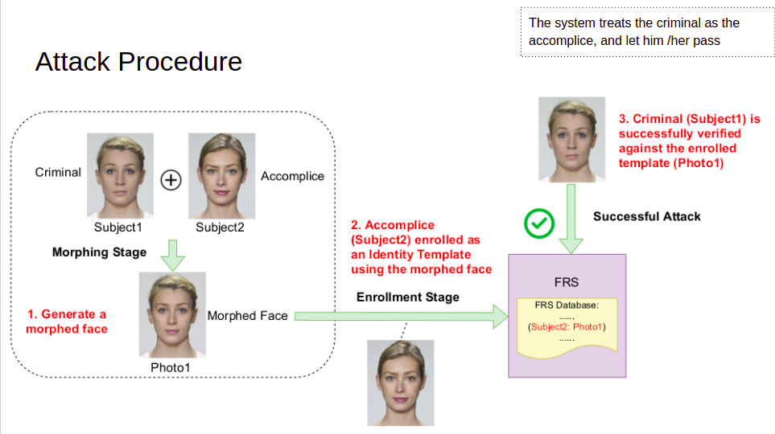
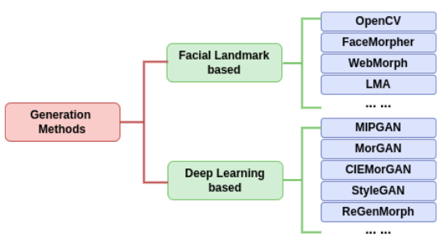
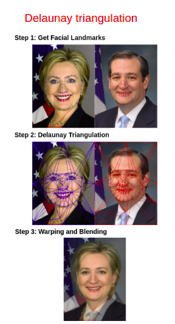

# face morphing attacks generation algorithms

This repository contains several landmarked based and deep leaning (GAN) based face morphing attacks generation methods.

# Attack Procedure

# Existing Morphing Tools/Techniques
* Numerous easy-to-use morphing tools online
   e.g., [[MorphThing]](https://www.morphthing.com/), [[3Dthis Face Morph]](https://3dthis.com/morph.htm), [[Face Swap Online]](https://faceswaponline.com/), [[Abrosoft FantaMorph]](http://www.fantamorph.com/), [[FaceMorpher]](http://www.facemorpher.com/), [[MagicMorph]](http://www.effectmatrix.com/morphing/).

* Techniques in literature

# landmark-based morphing
 * Works by obtaining landmark points on facial regions, e.g., nose, eye, and mouth.
 * The landmark points obtained from two bona fide faces are warped by moving the pixels to different, more averaged positions, 
 * e.g. Delaunay triangulation: 
      Affine transform, 
      Alpha blending
* Post-processing:
   misaligned pixels generating artifacts; ghost-like artifacts

# deep learning based morphing
 * Most are based on Generative Adversarial Networks (GAN) 
 * Most adopt CNN as basic architecture
 * Works by embedding the images in the intermediate latent space, e.g. StyleGAN : 
         Linear combination,
         Synthesize using Generator
* Post-processing if needed: 
   Synthetic-like generation artifacts
   

